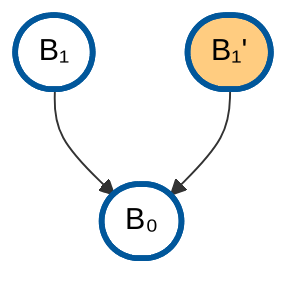

# Mermaid Common Styles

This file contains reusable Mermaid style definitions for diagrams throughout the book.

## How to Use

Copy the relevant style definitions from this page into your Mermaid diagrams. While the styles are also defined in `mermaid-common-styles.js` for potential programmatic use, Mermaid requires `classDef` statements to be included within each diagram block.

## PoW Block Styles

For Proof-of-Work blockchain diagrams:

```text
%% Define PoW block style with dark blue border and oval shape
classDef pow fill:#fff,stroke:#01579b,stroke-width:3px,color:#000
%% Define alternative PoW block style with orange fill for caution
classDef powAlt fill:#ffcc80,stroke:#01579b,stroke-width:3px,color:#000
```

### Usage Example



## Node Type Styles

Standard node types used across diagrams:

```text
classDef input fill:#e1f5ff,stroke:#01579b,stroke-width:3px,color:#000
classDef compute fill:#fff3e0,stroke:#e65100,stroke-width:2px,color:#000
classDef aggregate fill:#f3e5f5,stroke:#4a148c,stroke-width:2px,color:#000
classDef output fill:#e8f5e9,stroke:#1b5e20,stroke-width:3px,color:#000
classDef storage fill:#fce4ec,stroke:#880e4f,stroke-width:2px,color:#000
```
