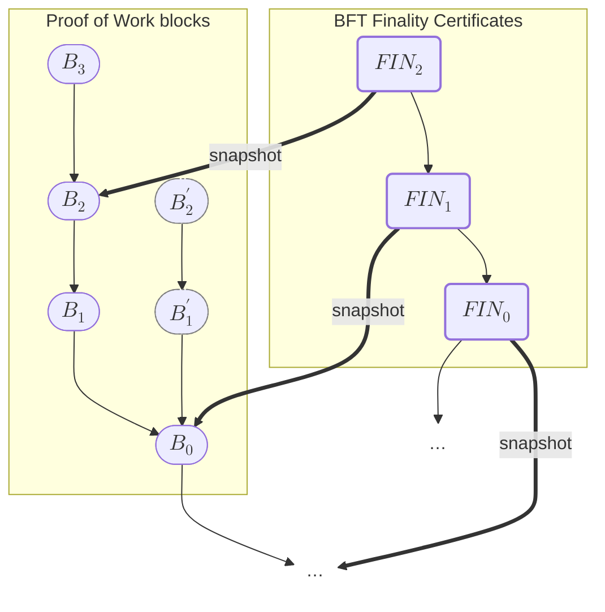

# A Visual Lexicon for TFL Book

## The Last Final Snapshot Rule

> **Last Final Snapshot rule:** $\snapshotlf{H} \preceq_{\bc} H$.

> For a bft‑block or bft‑proposal $B$, define $$
  \begin{array}{rl}
  \hphantom{\LF(H)}\snapshot(B) &\!\!\!\!:= \begin{cases}
    \Origin_{\bc},&\if B\dot\headersbc = \null \\
    B\dot\headersbc[0] \trunc_{\bc}^1,&\otherwise
  \end{cases}
  \end{array}
  $$

Note that the type of $B$ in the quoted definition is a BFT Finality Certificate.

> For a bc‑block $H$, define $$
  \begin{array}{rl}
  \hphantom{\snapshot(B)}\LF(H) &\!\!\!\!:= \bftlastfinal(H\dot\contextbft) \\
                  \candidate(H) &\!\!\!\!:= \lastcommonancestor(\snapshotlf{H}, H \trunc_{\bc}^\sigma)
  \end{array}
  $$
