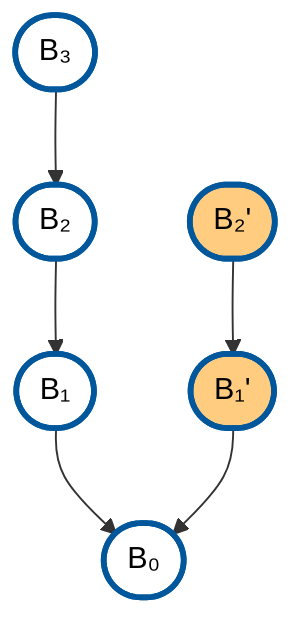

# A Visual Tour of Zcash Crosslink

## Zcash PoW

Currently the Zcash Mainnet uses consensus rules defined by Network Upgrade 6.1. This relies on a Bitcoin-like PoW consensus mechanism, which enables partition-tolerant high availability at the cost of forks / rollbacks. Here's a conceptual diagram of PoW blocks pointing to their parents (via `prevhash` header fields) which shows two objectively-verifiable histories leading back from PoW blocks _B₃_ and _B₂'_, with _B₃_ being the longer:

